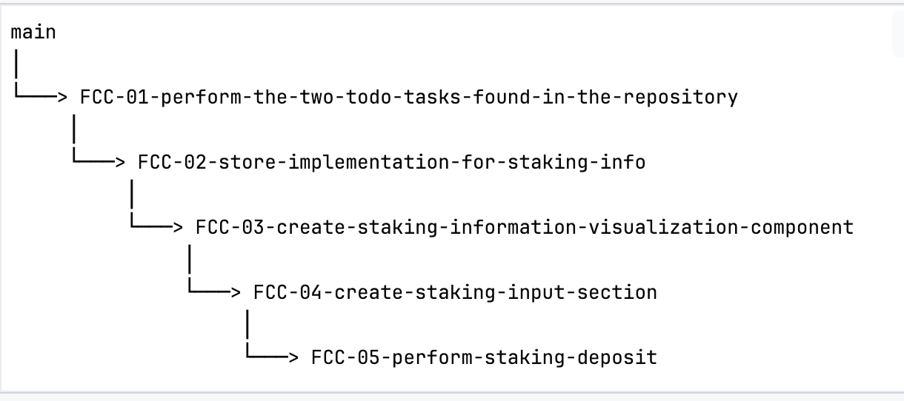

# Frontend Challenge Instructions

1. Unzip the original repository.

2. Create a new private repository on your GitHub account.

3. Add the following GitHub users as collaborators to your new repository: `ifgrup`, `nuriaciscar`.

4. Clone your new repository to your local development environment.

5. Copy the content from the zip file to your new repository.

6. Make the first commit. In this commit, you should assign the Story Point Estimates to each task in the `README.md`
   file.

7. The tasks should be performed in order. For each task, create a new branch with the name of the corresponding user
   story file found in the `docs` folder. For example, if the user story file is
   named `FCC-01-perform-the-two-todo-tasks-found-in-the-repository.md`, you can create a branch named `FCC-01-perform-the-two-todo-tasks-found-in-the-repository`.

8. Once you complete a task, create a pull request with the main branch as the base.

9. For the next task, create a new branch from the branch of the previous task (not from the main branch). When
   finished, create a pull request with the branch of the previous task as the base.

10. Repeat step 9 for all remaining tasks.

### Branching Strategy




    
Remember that each pull request should be reviewed and approved before being merged with the base branch. Keep your
commits small and frequent to facilitate code review.

## How to Assign Story Point Estimates

To assign Story Point Estimates to each task, follow these steps:

1. Open the `README.md` file in your code editor.
2. Look for the User Stories section.
3. In each User Story, you will see a section that says "Story Point Estimate: N/A".
4. Expand the User Story section by clicking on the story summary.
5. Replace "N/A" with the point estimate you wish to assign. You can use the Fibonacci sequence to assign the points (1, 2, 3, 5, 8, 13, etc.).
6. Save the changes and commit them.

This is how you can assign Story Point Estimates to each task in your project.


### User Stories

<details>
<summary>Perform the two TODO tasks found in the repository</summary>

[Perform the two TODO tasks found in the repository](./docs/FCC-01-perform-the-two-todo-tasks-found-in-the-repository.md)

#### Story Point Estimate: 1

</details>

<details>
<summary>Store implementation for staking info</summary>

[Store implementation for staking info](./docs/FCC-02-store-implementation-for-staking-info)

#### Story Point Estimate: 8

</details>
<details>
<summary>Create Staking Information Visualization Component(s)</summary>

[Create Staking Information Visualization Component(s)](./docs/FCC-03-create-staking-Information-component-view.md)

#### Story Point Estimate: 13

</details>
<details>
<summary>Create Staking Input Section</summary>

[Create Staking Input Section](./docs/FCC-04-create-staking-input-section.md)

#### Story Point Estimate: 21

</details>

<details>
<summary>Perform Staking Deposit</summary>

[Perform Staking Deposit](./docs/FCC-05-perform-staking-deposit.md)

#### Story Point Estimate: 34

</details>

## Environment Variables Configuration

To configure the environment variables for this project, you need to create a `.env` file in the root directory of the project. This file will contain key-value pairs that represent the environment variables needed for the project.

Here's an example of what your `.env` file might look like:

```env
# .env file
REACT_APP_PROJECT_ID=0c40dec082be837f851a3343250d65c7
REACT_APP_STAKING_CONTRACT_ADDRESS=0x13cC8AaEaF26d042E6947Fa8ab018FB0DB8A8Ff4
REACT_APP_BKN_CONTRACT_ADDRESS=0x97a13487f889dc770Ac925Be2d3b6c833FA7746a
```

## Extra Credits

If you need BKN tokens for staking, you can use the `giveMeMoreBknPapi` function from your browser's console. This function allows you to mint BKN tokens to your wallet. Here's how to use it:

1. Open your browser's console.
2. Type `window.bknApi.giveMeMoreBknPapi(amount)` where `amount` is the number of BKN tokens you want to mint.
3. Press Enter.

Please note that this function is for development purposes only and should not be used in a production environment.