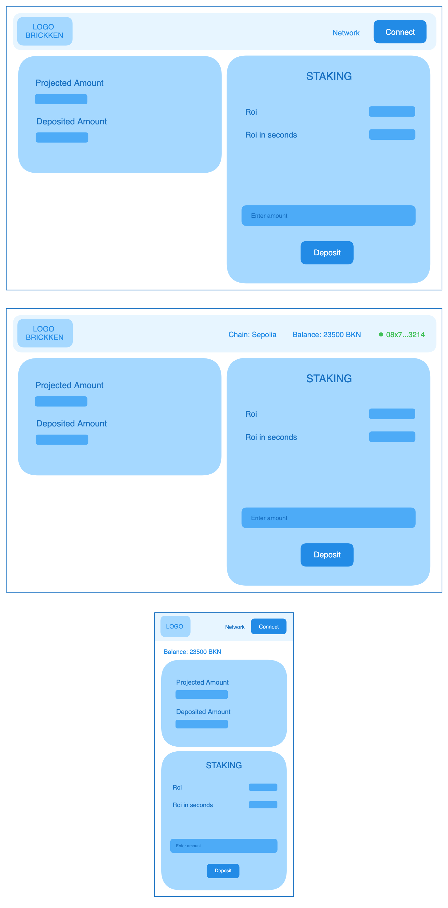

# User Story

## Title

Create Staking Information Visualization Component(s)

## Description

As a frontend developer, I want to create a component or components to visualize staking information. The component(s)
should be designed according to the provided mockup and should display all necessary staking information in a
user-friendly manner. The component(s) should also fetch the staking information from the store every time the address
obtained with `useWeb3ModalAccount()` changes, using the appropriate Redux selectors for loading and displaying the
information.

## Mockup
To set up the page with the components, follow the provided mockup.

Connect Button: Clicking the "Connect" button will open a modal window allowing the user to connect their wallet.
Upon successful connection, the modal will display the user's address and balance. Clicking on the user's address
will open the provided modal for managing the wallet, offering options such as disconnecting.

Network Button: The "Network" button serves as a clickable element to open a modal window for selecting the network.
Once a network is chosen, it should display the name of the selected network based on its chainId.

## Acceptance Criteria

1. A new component or components named `StakingInfoComponent` is created.
2. The `StakingInfoComponent` displays all necessary staking information, including but not limited to: projected
   amount, deposited amount, BKN amount, ROI, and whether the user is a staker.
3. The `StakingInfoComponent` matches the provided mockup in terms of design and layout.
4. The `StakingInfoComponent` is responsive and provides a good user experience on both desktop and mobile devices.
5. The `StakingInfoComponent` fetches the staking information from the store every time the address obtained
   with `useWeb3ModalAccount()` changes, using the appropriate Redux selectors for loading and displaying the
   information.
6. The `StakingInfoComponent` is integrated into the application and functions as expected, with no regressions.
7. The code adheres to clean code principles, improving maintainability and readability.

## Story Point Estimate

<!-- Here is where you can add your Story Points estimate -->